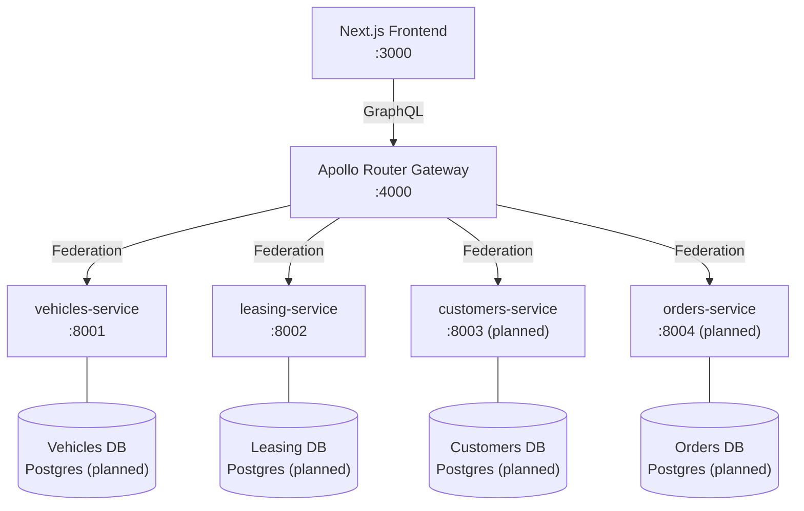
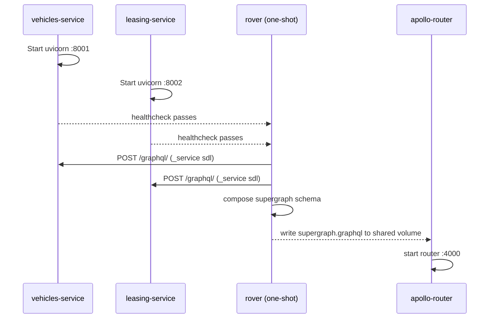
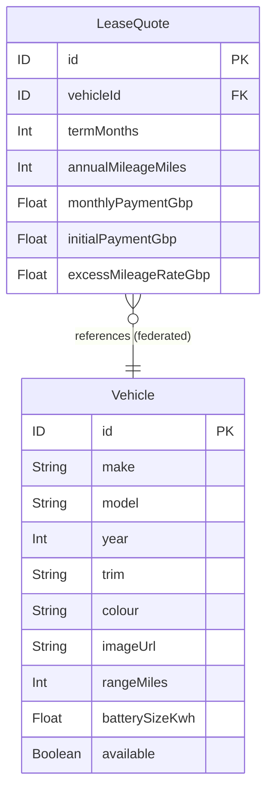

# EVLease

[](https://github.com/jordanleeevans/evlease/actions/workflows/ci.yml)
[](https://codecov.io/gh/jordanleeevans/evlease)

A modern EV leasing platform built as a GraphQL Federation microservices architecture, inspired by [Octopus EV](https://octopusev.com/).

## Tech Stack

### Backend
- **[FastAPI](https://fastapi.tiangolo.com/)** — async Python web framework for each microservice
- **[Ariadne](https://ariadnegraphql.org/)** — schema-first GraphQL library
- **[ariadne-federation](https://github.com/mirumee/ariadne-starlette)** — Apollo Federation v2 support for Ariadne subgraphs
- **[UV](https://docs.astral.sh/uv/)** — fast Python package and project manager
- **[Ruff](https://docs.astral.sh/ruff/)** — Python linter and formatter

### Gateway
- **[Apollo Router](https://www.apollographql.com/docs/router/)** v2.14.0 — Rust-based GraphQL federation gateway
- **[Rover CLI](https://www.apollographql.com/docs/rover/)** — supergraph schema composition

### Frontend _(planned)_
- **[Next.js](https://nextjs.org/)** — React framework with App Router
- **[Apollo Client](https://www.apollographql.com/docs/react/)** — GraphQL client

### Infrastructure
- **Docker + Docker Compose** — local development orchestration
- **PostgreSQL** — one database per service _(planned — currently in-memory mock data)_

---

## Progress

| Component | Status | Notes |
|---|---|---|
| `vehicles-service` | ✅ Complete | Federation entity, 10 mock EVs, full test suite |
| `leasing-service` | ✅ Complete | Quote engine, pricing logic, federation stub, full test suite |
| Apollo Router gateway | ✅ Complete | Federation v2, sandbox enabled, supergraph composed via Rover |
| `customers-service` | 🔲 Planned | Auth, profiles, saved vehicles |
| `orders-service` | 🔲 Planned | Lease applications, order status |
| Next.js frontend | 🔲 Planned | Vehicle listing, quote calculator |
| PostgreSQL databases | 🔲 Planned | Replace in-memory mock data |

---

## Architecture

### System Overview



### Docker Compose Startup Sequence



### Federation Entity Relationships



> `Vehicle` is owned by `vehicles-service`. `LeaseQuote.vehicle` is resolved by the Apollo Router via entity fetching — `leasing-service` only stores the `vehicleId`.

---

## Services

| Service | Port | Responsibility |
|---|---|---|
| `vehicles-service` | `8001` | Vehicle catalogue, specs, availability |
| `leasing-service` | `8002` | Quote engine, pricing rules, lease terms |
| `customers-service` | `8003` | Auth, user profiles, documents _(planned)_ |
| `orders-service` | `8004` | Applications, order status _(planned)_ |
| Gateway | `4000` | Apollo Router — unified GraphQL API |
| Frontend | `3000` | Next.js application _(planned)_ |

---

## Repository Structure

```
evlease/
├── gateway/
│   ├── Dockerfile.rover        # Rover CLI image for schema composition
│   ├── router.yaml             # Apollo Router config (introspection, sandbox)
│   └── supergraph.yaml         # Rover supergraph composition config
├── services/
│   ├── vehicles/               # FastAPI + Ariadne federation subgraph
│   │   ├── database.py         # In-memory mock data (10 EVs)
│   │   ├── repositories/       # Data access layer
│   │   ├── main.py             # FastAPI app, GraphQL mount, resolvers
│   │   ├── schema.graphql      # Vehicle type with @key federation directive
│   │   ├── tests/
│   │   ├── pyproject.toml
│   │   └── Dockerfile
│   └── leasing/                # FastAPI + Ariadne federation subgraph
│       ├── database.py         # Base prices, term/mileage multipliers
│       ├── repositories/       # Quote calculation logic
│       ├── main.py             # FastAPI app, GraphQL mount, resolvers
│       ├── schema.graphql      # LeaseQuote type, Vehicle stub (@key resolvable: false)
│       ├── tests/
│       ├── pyproject.toml
│       └── Dockerfile
├── docker-compose.yml
├── .pre-commit-config.yaml
└── README.md
```

---

## Getting Started

### Prerequisites

- [UV](https://docs.astral.sh/uv/getting-started/installation/) — Python package manager
- [Docker Desktop](https://www.docker.com/products/docker-desktop/)

### Running Locally

```bash
# Start all services (builds images, composes supergraph, starts gateway)
docker compose up --build
```

The GraphQL sandbox will be available at **http://localhost:4000**.

Individual subgraph health checks:
- Vehicles: http://localhost:8001/health
- Leasing: http://localhost:8002/health

### Running a single service for development

```bash
cd services/vehicles
uv sync
uv run uvicorn main:app --reload --port 8001
```

---

## GraphQL Examples

### List all vehicles
```graphql
query {
  vehicles {
    id
    make
    model
    year
    rangeMiles
    batterySizeKwh
    available
  }
}
```

### Get a lease quote (federated — spans two services)
```graphql
query {
  leaseQuote(vehicleId: "1", termMonths: 36, annualMileageMiles: 10000) {
    monthlyPaymentGbp
    initialPaymentGbp
    excessMileageRateGbp
    vehicle {
      make
      model
      year
      rangeMiles
    }
  }
}
```

### Get all plans for a vehicle
```graphql
query {
  leasePlans(vehicleId: "1") {
    id
    termMonths
    annualMileageMiles
    monthlyPaymentGbp
    initialPaymentGbp
  }
}
```

---

## Leasing Pricing Logic

Quotes are calculated as:

$$\text{monthly} = \text{basePrice} \times \text{termMultiplier} \times \text{mileageMultiplier}$$

$$\text{initialPayment} = \text{monthly} \times 3$$

| Term | Multiplier |
|------|-----------|
| 24 months | 1.08× |
| 36 months | 1.00× (standard) |
| 48 months | 0.94× |

| Annual Mileage | Multiplier |
|----------------|-----------|
| 8,000 miles | 0.94× |
| 10,000 miles | 1.00× (standard) |
| 12,000 miles | 1.06× |
| 15,000 miles | 1.13× |
| 20,000 miles | 1.22× |

---

## Development

### Code Quality

```bash
# Lint
uv run ruff check .

# Format
uv run ruff format .
```

Pre-commit hooks run Ruff automatically on every commit.

### Testing

```bash
cd services/vehicles
uv run pytest -v

cd services/leasing
uv run pytest -v
```

